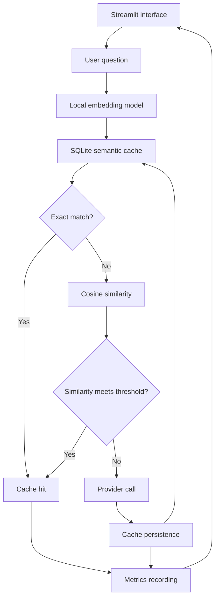
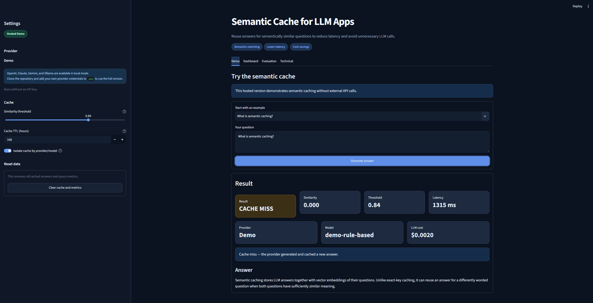
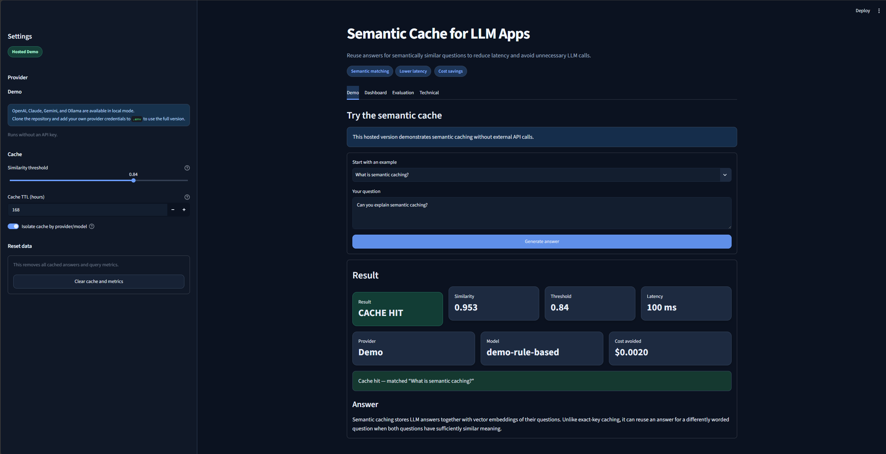
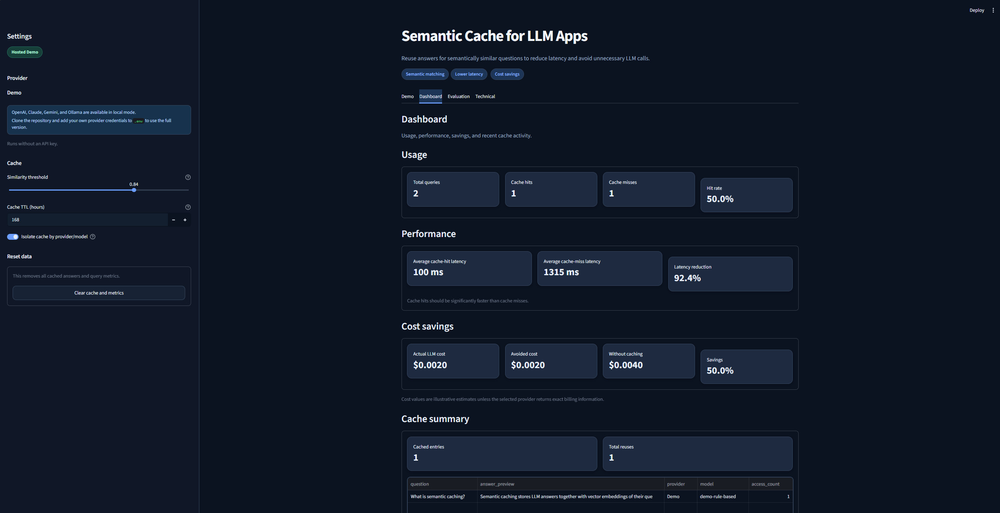
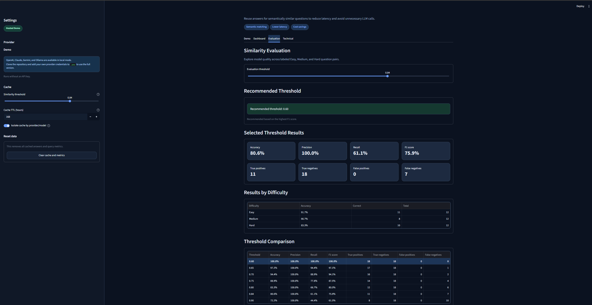
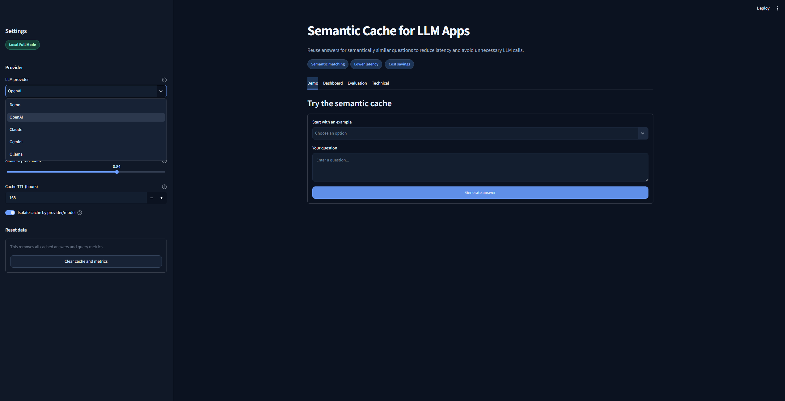

# Semantic Cache for LLM Apps

A Streamlit application that reuses answers for semantically equivalent questions to reduce LLM latency, provider calls, and estimated cost.


---

## Overview

LLM applications often receive repeated questions that use different wording but express the same intent. Sending every equivalent request to a model adds avoidable latency and cost.

This project generates a normalized local embedding for each question and compares it with valid cached embeddings using cosine similarity. When an exact match or a semantic match reaches the configured threshold, the application returns the stored answer without another provider call. When no cached entry qualifies, the selected provider generates an answer, and the question, embedding, response, provider, model, and expiration data are persisted in SQLite for future reuse.

---

## Key Features

- Local Sentence Transformer embeddings with normalized vectors
- Exact-match and semantic cache lookup with configurable similarity threshold and TTL
- Persistent SQLite storage with safe schema migration
- Optional cache isolation by provider and model
- Offline rule-based Demo provider with simulated LLM latency and illustrative cost
- OpenAI, Claude, Gemini, and Ollama integrations for local full mode
- Dashboard metrics for usage, latency, cache activity, and estimated savings
- Cache Explorer with selective entry deletion
- Evaluation dataset with 36 labeled positive and negative question pairs
- Easy, Medium, and Hard evaluation categories with pair-level results
- Multi-threshold comparison and automatic threshold recommendation

---

## Live Demo

The hosted Streamlit demo link will be added after deployment.

The hosted version runs in **Demo** mode without external API calls or visitor-supplied API keys.

---

## Demo Workflow

1. Select **Demo**. It works fully offline after the embedding model is available.
2. Clear the cache if you want a clean comparison.
3. Ask `What is semantic caching?` to create a cache miss. The provider waits about 1.2 seconds to simulate an LLM call and assigns an illustrative cost of $0.002.
4. Ask `Can you explain semantic cache?` to test a semantic cache hit.
5. Compare the status, similarity, threshold, latency, provider, model, cost, and matched cached question.
6. Open **Dashboard** to compare hit and miss latency and estimated savings.
7. Open **Evaluation**, adjust its independent threshold slider, and inspect pair-level predictions, accuracy by difficulty, and the multi-threshold comparison.
8. Compare the manually selected threshold with the automatic recommendation based on F1, precision, and threshold tie-breakers.
9. Open **Technical** to review the request flow, engineering decisions, and Cache Explorer.

The Demo provider also recognizes questions about semantic caching, cost reduction, embeddings, cosine similarity, cache hits, cache misses, and threshold tuning. Unknown topics receive a useful offline fallback.

---

## System Architecture



---

## Semantic Cache Workflow

1. **Question normalization:** Trim the incoming question, convert it to lowercase for lookup, and normalize repeated whitespace.
2. **Embedding generation:** Encode the cleaned question with the local `sentence-transformers/all-MiniLM-L6-v2` model and normalize the resulting vector.
3. **Exact-match lookup:** Search for the most recent valid entry with the same normalized question.
4. **TTL filtering:** Exclude entries whose configured expiration time has passed.
5. **Cosine-similarity comparison:** Compare the query vector with candidate cached vectors when no exact match exists.
6. **Provider/model isolation:** When enabled, restrict candidates to the selected provider and model.
7. **Threshold decision:** Treat the best candidate as a semantic cache hit only when its similarity reaches the selected threshold.
8. **Reuse or invocation:** Return the stored answer on a hit; otherwise call the selected provider.
9. **Cache persistence:** Store the new question, embedding, answer, provider, model, cost estimate, and TTL after a miss.
10. **Event and metric recording:** Record hit or miss status, similarity, latency, provider, model, and estimated cost for dashboard reporting.

---

## Provider Support

| Provider | Configuration | Behavior |
|---|---|---|
| Demo | No API key required | Offline rule-based responses for safe demonstration |
| OpenAI | `OPENAI_API_KEY`, `OPENAI_MODEL` | Uses the official OpenAI SDK |
| Claude | `ANTHROPIC_API_KEY`, `CLAUDE_MODEL` | Uses the official Anthropic SDK |
| Gemini | `GEMINI_API_KEY`, `GEMINI_MODEL` | Uses the official Google Gen AI SDK |
| Ollama | `OLLAMA_BASE_URL`, `OLLAMA_MODEL` | Calls a locally running Ollama server |

Cache isolation by provider and model prevents responses generated by different backends from being mixed.

---

## Hosted Demo vs Local Full Mode

### Hosted Demo

- Runs with the Demo provider only and requires no API key.
- Demonstrates cache hits, cache misses, latency reduction, evaluation, and cost-saving metrics.
- OpenAI, Claude, Gemini, and Ollama are intentionally disabled.
- No visitor API keys are collected, displayed, stored, logged, or transmitted.
- External provider API keys must not be added to the public deployment.

The public deployment must use:

```toml
APP_MODE="demo"
```

### Local Full Mode

Local mode supports Demo, OpenAI, Claude, Gemini, and Ollama. Users create a local `.env` file and add only the credentials for providers they intend to use. API keys remain in the local environment and must never be committed to GitHub. The application does not request API keys through the browser interface.

---

## Similarity Evaluation

The **Evaluation** tab uses 36 labeled question pairs: 18 positive matches and 18 negative matches. The dataset contains Easy, Medium, and Hard examples related to semantic caching and LLM engineering.

For each pair, the application embeds both questions, calculates cosine similarity, applies the manually selected evaluation threshold, and compares the predicted match with the expected label. It reports pair-level results together with accuracy, precision, recall, F1 score, true positives (TP), true negatives (TN), false positives (FP), and false negatives (FN). Accuracy is also reported separately for Easy, Medium, and Hard pairs.

---

## Threshold Tuning

The evaluation threshold is controlled independently from the cache threshold so users can test classification behavior without changing live cache lookup behavior.

The multi-threshold comparison evaluates `0.60`, `0.65`, `0.70`, `0.75`, `0.80`, `0.84`, and `0.90`. The recommended threshold is selected by the highest F1 score. Ties prefer higher precision, followed by the higher threshold.

Lower thresholds generally improve recall but may introduce unsafe false positives. Higher thresholds generally improve precision but may miss valid rephrasings. A production threshold should be selected with representative domain data.

---

## Metrics and Cost Savings

The **Dashboard** separates usage, performance, and estimated cost metrics:

```text
hit rate              = cache hits / total queries × 100
cache-hit latency     = average latency across cache-hit events
cache-miss latency    = average latency across cache-miss events
latency reduction     = (cache-miss latency - cache-hit latency)
                        / cache-miss latency × 100
actual LLM cost       = estimated cost across cache misses
avoided cost          = estimated cost across cache hits
cost without caching  = actual LLM cost + avoided cost
savings percentage    = avoided cost / cost without caching × 100
```

Zero-query, zero-latency, and zero-cost cases safely report zero where a denominator is unavailable. Cost values are illustrative estimates unless a selected provider returns exact billing information.

---

## Tech Stack

| Technology | Purpose |
|---|---|
| Python | Application language and cache orchestration |
| Streamlit | Interactive web interface and dashboard |
| Sentence Transformers | Local semantic embedding generation |
| NumPy | Vector handling and cosine-similarity calculation |
| Pandas | Evaluation and dashboard data presentation |
| SQLite | Persistent cache entries, query events, and metrics |
| OpenAI SDK | OpenAI provider integration |
| Anthropic SDK | Claude provider integration |
| Google Gen AI SDK | Gemini provider integration |
| Ollama | Local LLM provider option through its HTTP API |
| python-dotenv | Local environment-variable loading |

---

## Project Structure

```text
Semantic-Cache-for-LLM-Apps/
├── .env.example
├── .gitignore
├── .streamlit/config.toml
├── assets/screenshots/
├── app.py
├── data/.gitkeep
├── README.md
├── requirements.txt
├── src/__init__.py
├── src/cache_store.py
├── src/config.py
├── src/embeddings.py
├── src/evaluation.py
├── src/llm_providers.py
├── src/models.py
└── src/semantic_cache.py
```

Runtime-generated SQLite database files are ignored by Git and are not committed project files.

### Main Files

| File | Purpose |
|---|---|
| `app.py` | Streamlit interface, navigation, and presentation logic |
| `src/semantic_cache.py` | Cache-hit and cache-miss orchestration |
| `src/cache_store.py` | SQLite persistence, lookup, migrations, events, and metrics |
| `src/embeddings.py` | Local normalized embedding generation |
| `src/llm_providers.py` | Demo, OpenAI, Claude, Gemini, and Ollama provider adapters |
| `src/evaluation.py` | Labeled dataset, threshold comparison, and evaluation metrics |
| `src/config.py` | Environment-backed application configuration |
| `.env.example` | Safe local configuration template |
| `requirements.txt` | Python dependency declarations |

---

## Installation

### 1. Clone the Repository

```bash
git clone https://github.com/Azoqoz/Semantic-Cache-for-LLM-Apps.git
cd Semantic-Cache-for-LLM-Apps
```

### 2. Create a Virtual Environment

Windows PowerShell:

```powershell
python -m venv .venv
.venv\Scripts\Activate.ps1
```

macOS/Linux:

```bash
python3 -m venv .venv
source .venv/bin/activate
```

### 3. Install the Dependencies

```bash
pip install -r requirements.txt
```

The first run downloads `sentence-transformers/all-MiniLM-L6-v2`.

### 4. Configure the Environment

Windows PowerShell:

```powershell
Copy-Item .env.example .env
```

macOS/Linux:

```bash
cp .env.example .env
```

Keep `APP_MODE=local` for local full mode, then add only the provider settings you need.

---

## Running the Application

```bash
streamlit run app.py
```

Streamlit typically serves the local application at `http://localhost:8501`.

---

## Local Provider Configuration

Create `.env` from `.env.example`. Only the credentials for providers you use are required:

```dotenv
APP_MODE=local

OPENAI_API_KEY=
OPENAI_MODEL=gpt-4.1-mini

ANTHROPIC_API_KEY=
CLAUDE_MODEL=claude-haiku-4-5

GEMINI_API_KEY=
GEMINI_MODEL=gemini-3.5-flash

OLLAMA_BASE_URL=http://localhost:11434
OLLAMA_MODEL=llama3.2
```

Demo requires no API key. Ollama requires a local Ollama server but no cloud credential. Keep `.env` local and never commit secrets to Git.

---

## Deployment

To deploy on Streamlit Community Cloud:

1. Push the repository to GitHub.
2. Create a Streamlit Community Cloud application that uses `app.py` as its entry point.
3. Set the public deployment mode in Streamlit secrets or the environment:

```toml
APP_MODE="demo"
```

4. Deploy and verify the Demo, Dashboard, Evaluation, and Technical tabs.

The public deployment must remain in Demo mode. Do not add OpenAI, Anthropic, Gemini, or other external provider API keys to the public demo.

---

## Screenshots

### Hosted Demo — Cache Miss



### Hosted Demo — Semantic Cache Hit



### Dashboard



### Similarity Evaluation



### Local Full Mode



---

## Current Limitations

- SQLite similarity lookup scans valid rows and is intended for a portfolio-scale demo.
- Semantic similarity does not guarantee factual equivalence.
- Cost values are illustrative unless a provider supplies exact billing information.
- Production deployments require additional tenant isolation, encryption, observability, and a vector index.

---

## Future Improvements

- Add Redis vector search for distributed cache access.
- Introduce approximate nearest-neighbor indexing for larger cache collections.
- Support multi-tenant namespaces and access isolation.
- Add PII detection and filtering before persistence.
- Implement automated invalidation policies beyond TTL.
- Export traces and metrics through OpenTelemetry or Prometheus.
- Add Docker packaging for reproducible local and hosted environments.
- Expand unit and integration test coverage.
- Add CI/CD checks for tests, formatting, and deployment.
- Grow the evaluation dataset with domain-specific and adversarial pairs.

---

## Why This Project Matters

This project demonstrates an AI engineering pattern that directly addresses two practical constraints in LLM applications: response latency and repeated inference cost. It goes beyond a simple prompt interface by treating semantic reuse as a measurable system with explicit persistence, evaluation, and operational boundaries.

The implementation demonstrates:

- **Embeddings and semantic similarity** through local Sentence Transformer vectors and cosine comparison
- **Cache architecture** through exact-match and threshold-based semantic lookup
- **Persistent storage** through SQLite cache entries, TTL handling, query events, and metrics
- **Provider abstraction** through a consistent interface for Demo, OpenAI, Claude, Gemini, and Ollama
- **Latency optimization** by returning valid stored answers without another provider request
- **Cost optimization** by estimating actual and avoided model-call cost
- **Threshold evaluation** through labeled pairs, confusion counts, F1-based selection, and difficulty analysis
- **Observability** through hit rate, latency, cache activity, and savings metrics
- **Secure hosted/local separation** by disabling external providers and visitor credentials in public Demo mode
- **Multi-provider integration** without mixing cache entries across providers or models when isolation is enabled

Together, these capabilities show how an LLM feature can be designed as an observable, configurable, and security-conscious application component rather than a single model call.

---

## Author

Developed by [Azoqoz](https://github.com/Azoqoz).
