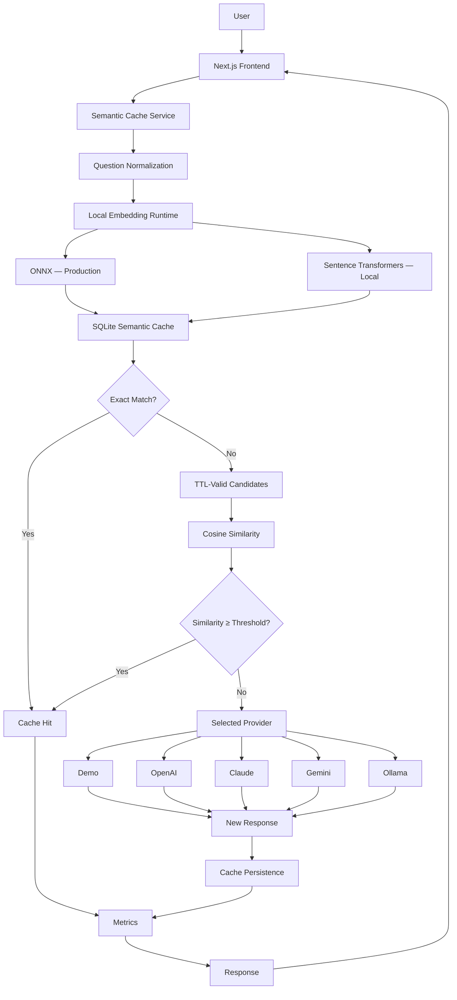
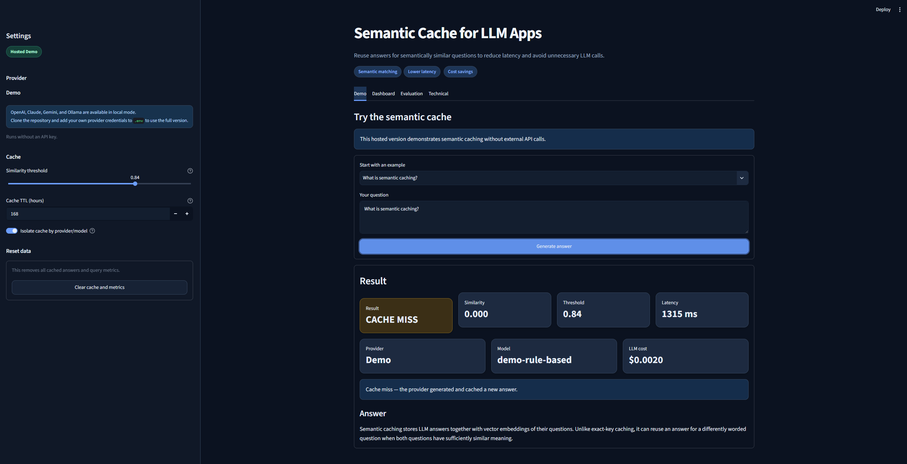
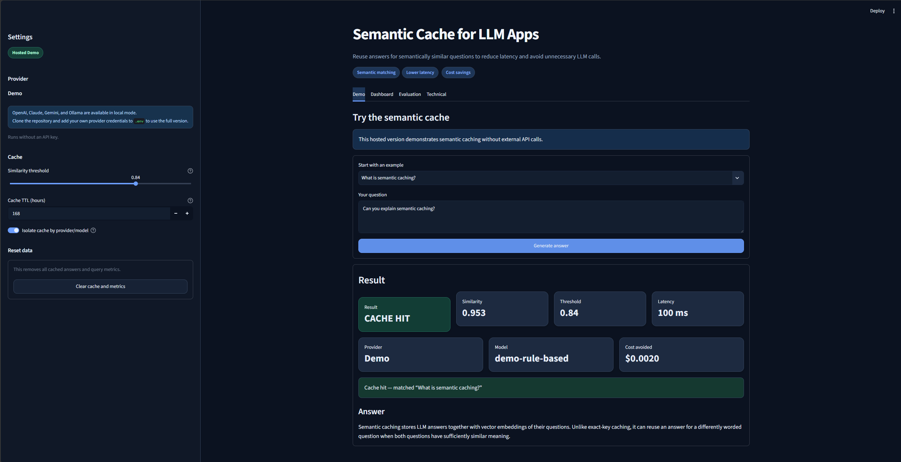
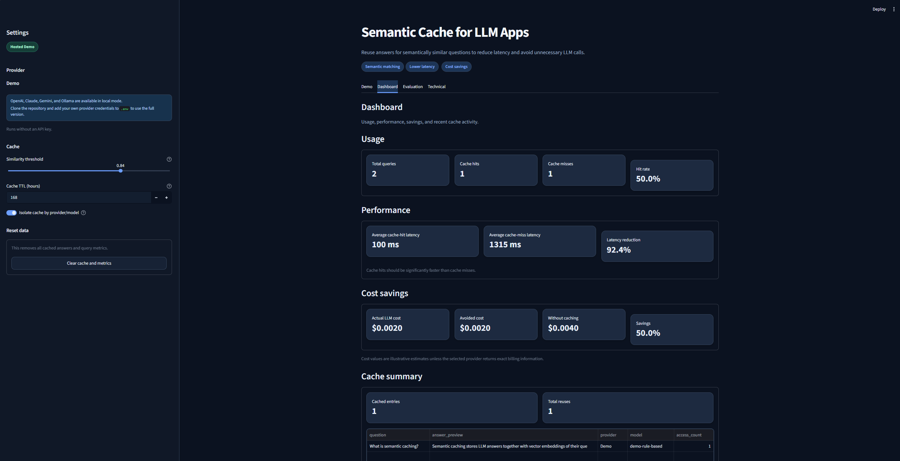
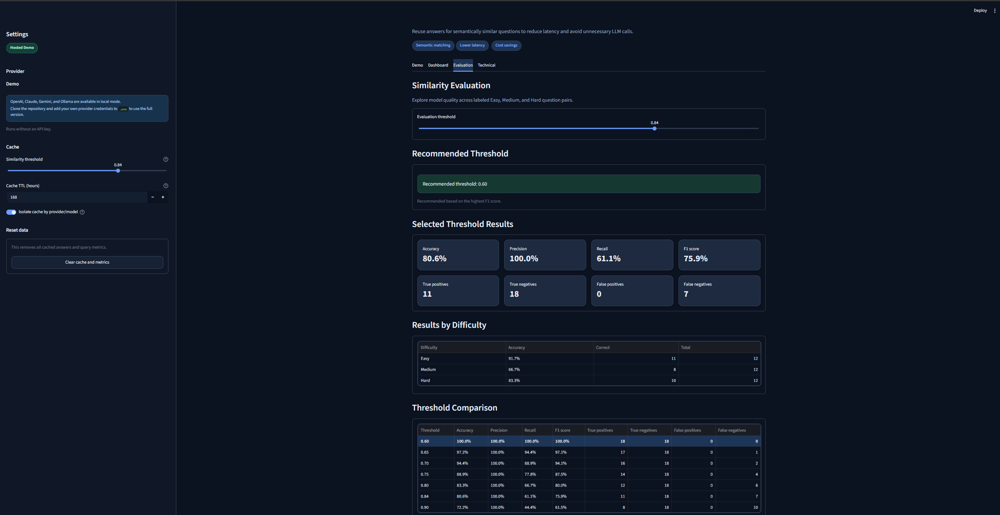
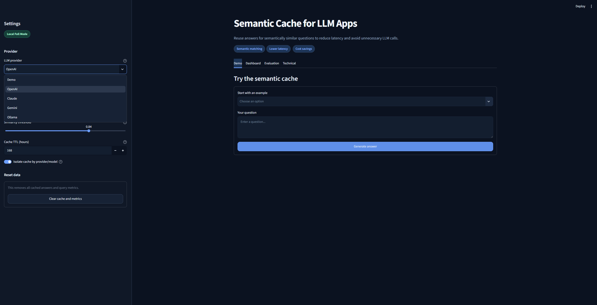

# Semantic Cache for LLM Apps

A production-oriented semantic caching layer for LLM applications that reuses answers for semantically equivalent questions using local embeddings, cosine similarity, persistent SQLite storage, TTL expiration, provider/model isolation, and measurable cache-performance evaluation.


---

## Live Application

**Web Application:**  
https://semantic-cache-for-llm-apps-wq2w.vercel.app

The hosted application runs in a restricted public-demo configuration and does not require visitors to provide external LLM API keys.

---

## Overview

LLM applications often receive repeated questions that differ in wording while expressing the same underlying intent.

Sending every equivalent request to an LLM creates unnecessary:

- Latency
- Provider traffic
- Inference cost
- Repeated computation

Semantic Cache for LLM Apps introduces a reusable caching layer between the application and the selected model provider.

For each incoming question, the system:

1. Normalizes the input
2. Generates a local semantic embedding
3. Checks for an exact cached match
4. Filters expired cache entries using TTL
5. Compares valid cached embeddings using cosine similarity
6. Optionally isolates matches by provider and model
7. Reuses a cached answer when the configured similarity threshold is reached
8. Calls the selected provider only on a cache miss
9. Persists the new response for future reuse
10. Records cache and performance metrics

This allows semantically equivalent prompts to reuse previous answers without requiring another provider request.

---

## Key Features

- Exact-match cache lookup
- Semantic cache lookup
- Local embedding generation
- Normalized embedding vectors
- Cosine-similarity matching
- Configurable semantic threshold
- Configurable TTL expiration
- Persistent SQLite cache storage
- Safe SQLite schema migration
- Optional provider isolation
- Optional model isolation
- OpenAI integration
- Anthropic Claude integration
- Google Gemini integration
- Local Ollama integration
- Offline Demo provider
- Public Demo Mode
- Full Local Mode
- Cache-hit and cache-miss tracking
- Latency measurement
- Estimated cost tracking
- Estimated avoided-cost tracking
- Hit-rate calculation
- Cache Explorer
- Selective cache-entry deletion
- Labeled semantic-similarity evaluation dataset
- Easy, Medium, and Hard evaluation categories
- Accuracy, precision, recall, and F1 measurement
- Multi-threshold evaluation
- Automatic threshold recommendation
- Production ONNX embedding runtime
- Modern Next.js production frontend
- Legacy Streamlit interface retained for project history

---

## Cache Workflow

```text
User Question
      |
      v
Question Normalization
      |
      v
Local Embedding Generation
      |
      v
Exact-Match Lookup
      |
      +-------- Match --------+
      |                       |
      |                       v
      |                  Cache Hit
      |
      v
TTL Filtering
      |
      v
Candidate Embedding Comparison
      |
      v
Cosine Similarity
      |
      v
Similarity >= Threshold?
     / \
   Yes  No
    |    |
    |    v
    |  LLM Provider Call
    |    |
    |    v
    |  Cache Persistence
    |    |
    +----+
      |
      v
Metrics Recording
      |
      v
Application Response
```

---

## System Architecture


```mermaid
flowchart TD
    A["User"] --> B["Next.js Frontend"]

    B --> C["Semantic Cache Service"]

    C --> D["Question Normalization"]
    D --> E["Local Embedding Runtime"]

    E --> E1["ONNX — Production"]
    E --> E2["Sentence Transformers — Local"]

    E1 --> F["SQLite Semantic Cache"]
    E2 --> F

    F --> G{"Exact Match?"}

    G -->|Yes| H["Cache Hit"]
    G -->|No| I["TTL-Valid Candidates"]

    I --> J["Cosine Similarity"]
    J --> K{"Similarity ≥ Threshold?"}

    K -->|Yes| H
    K -->|No| L["Selected Provider"]

    L --> L1["Demo"]
    L --> L2["OpenAI"]
    L --> L3["Claude"]
    L --> L4["Gemini"]
    L --> L5["Ollama"]

    L1 --> M["New Response"]
    L2 --> M
    L3 --> M
    L4 --> M
    L5 --> M

    M --> N["Cache Persistence"]

    H --> O["Metrics"]
    N --> O

    O --> P["Response"]
    P --> B
```

---

## Semantic Cache Workflow

### 1. Question Normalization

Incoming questions are cleaned before lookup.

The system:

- Trims surrounding whitespace
- Converts text to lowercase for normalized lookup
- Collapses repeated whitespace

This improves exact-match consistency.

---

### 2. Embedding Generation

The semantic representation is based on:

```text
sentence-transformers/all-MiniLM-L6-v2
```

The question is encoded into a normalized vector.

Normalized embeddings make cosine-similarity comparison straightforward and reproducible.

---

### 3. Exact-Match Lookup

Before performing semantic comparison, the cache searches for a valid entry with the same normalized question.

Exact hits avoid unnecessary vector comparison.

---

### 4. TTL Filtering

Cached responses can expire.

Each entry stores expiration information so outdated cache records are excluded automatically.

```text
Valid Entry
    ↓
Current Time < Expiration Time
```

Expired entries are not considered valid semantic matches.

---

### 5. Semantic Similarity

When an exact match is not found, the incoming embedding is compared with valid cached embeddings.

Similarity is measured using:

```text
Cosine Similarity
```

The cache selects the strongest candidate.

---

### 6. Provider and Model Isolation

Cache candidates can optionally be restricted to the active:

```text
Provider
Model
```

This prevents a response generated by one provider or model from being unintentionally reused for another configuration.

Example:

```text
OpenAI / Model A
```

can remain isolated from:

```text
Gemini / Model B
```

even when the prompts are semantically similar.

---

### 7. Threshold Decision

The highest-similarity candidate becomes a cache hit only when:

```text
similarity >= configured threshold
```

Otherwise the request is treated as a cache miss.

---

### 8. Provider Invocation

On a cache miss, the selected provider generates a new answer.

That answer can then be stored for future reuse.

---

### 9. Cache Persistence

A cache entry can contain information such as:

```text
Normalized question
Embedding
Response
Provider
Model
Estimated cost
Creation time
Expiration time
```

The persistent SQLite store allows cache data to survive application restarts.

---

### 10. Metrics Recording

Each request records operational information such as:

- Cache hit or miss
- Similarity
- Threshold
- Latency
- Provider
- Model
- Estimated cost
- Matched cached question

This turns semantic caching into a measurable system rather than an invisible optimization.

---

## Provider Support

| Provider | Configuration | Behavior |
|---|---|---|
| Demo | No API key | Offline deterministic responses |
| OpenAI | `OPENAI_API_KEY`, `OPENAI_MODEL` | Official OpenAI SDK |
| Claude | `ANTHROPIC_API_KEY`, `CLAUDE_MODEL` | Official Anthropic SDK |
| Gemini | `GEMINI_API_KEY`, `GEMINI_MODEL` | Official Google Gen AI SDK |
| Ollama | `OLLAMA_BASE_URL`, `OLLAMA_MODEL` | Local Ollama server |

Cache isolation by provider and model prevents answers generated by different backends from being mixed when isolation is enabled.

---

## Application Modes

The application separates its hosted demonstration environment from full local-provider access.

| Mode | External API Keys | Providers | Intended Use |
|---|---|---|---|
| Public Demo | Not required | Demo provider | Safe hosted demonstration |
| Full Local | Optional | Demo, OpenAI, Claude, Gemini, Ollama | Local experimentation |

---

## Public Demo Mode

The hosted version runs without requiring external LLM credentials.

In Public Demo Mode:

- No visitor API keys are requested
- No visitor API keys are stored
- No visitor API keys are logged
- OpenAI is disabled
- Claude is disabled
- Gemini is disabled
- Ollama is disabled
- The local Demo provider is used
- Semantic embeddings remain active
- Exact matching remains active
- Semantic matching remains active
- TTL remains active
- SQLite cache behavior remains active
- Latency metrics remain active
- Estimated cost metrics remain active
- Evaluation remains available

The Demo provider simulates the behavior of an LLM request so cache-hit and cache-miss behavior can be demonstrated safely.

---

## Full Local Mode

Full Local Mode enables all supported providers.

Available providers:

```text
Demo
OpenAI
Claude
Gemini
Ollama
```

Users supply only the credentials required for the providers they intend to use.

Credentials remain in the local environment.

The application does not require API keys to be entered through the browser interface.

---

## Demo Workflow

A simple semantic-cache demonstration:

### First Request

Ask:

```text
What is semantic caching?
```

This should produce a cache miss if no matching entry exists.

The Demo provider simulates an LLM request and the resulting response is stored.

---

### Semantic Rephrasing

Then ask:

```text
Can you explain semantic cache?
```

The system generates a new embedding and compares it with the cached question.

If similarity reaches the configured threshold:

```text
Semantic Cache Hit
```

The stored answer is reused without another provider call.

---

### Inspect the Result

The application can expose:

- Hit / miss status
- Similarity
- Threshold
- Request latency
- Provider
- Model
- Estimated cost
- Matched cached question

---

## Similarity Evaluation

The project contains a labeled evaluation dataset with:

```text
36 question pairs
```

The dataset is split into:

```text
18 positive semantic matches
18 negative semantic matches
```

Examples are categorized by difficulty:

```text
Easy
Medium
Hard
```

For every pair, the evaluator:

1. Embeds both questions
2. Computes cosine similarity
3. Applies the selected threshold
4. Predicts Match or No Match
5. Compares the prediction with the expected label

Metrics include:

- Accuracy
- Precision
- Recall
- F1
- True Positives
- True Negatives
- False Positives
- False Negatives

Accuracy is also tracked by difficulty category.

---

## Threshold Tuning

The evaluation threshold is independent from the live cache threshold.

This allows threshold experiments without changing normal cache behavior.

The documented threshold comparison evaluates:

```text
0.60
0.65
0.70
0.75
0.80
0.84
0.90
```

The automatic recommendation selects the threshold with the highest:

```text
F1 score
```

Tie-breaking prefers:

```text
1. Higher precision
2. Higher threshold
```

Lower thresholds generally increase recall but can introduce unsafe false-positive cache hits.

Higher thresholds generally increase precision but may miss valid rephrasings.

A real production threshold should therefore be selected using representative domain data.

---

## Metrics

The application tracks cache behavior, performance, and estimated cost.

### Hit Rate

```text
cache hits
---------------- × 100
total queries
```

---

### Cache-Hit Latency

```text
Average latency across cache-hit events
```

---

### Cache-Miss Latency

```text
Average latency across cache-miss events
```

---

### Latency Reduction

```text
cache-miss latency - cache-hit latency
-------------------------------------- × 100
          cache-miss latency
```

---

### Actual LLM Cost

```text
Estimated provider cost across cache misses
```

---

### Avoided Cost

```text
Estimated cost represented by cache hits
```

---

### Cost Without Caching

```text
actual LLM cost + avoided cost
```

---

### Estimated Savings Percentage

```text
avoided cost
--------------------- × 100
cost without caching
```

Zero-query, zero-latency, and zero-cost states safely return zero when a denominator is unavailable.

Cost values are illustrative estimates unless a provider supplies exact billing information.

---

## Production Embedding Runtime

The original semantic cache uses:

```text
sentence-transformers/all-MiniLM-L6-v2
```

for local embedding generation.

The production deployment also includes an ONNX embedding runtime.

This provides a deployment-oriented embedding path while preserving the same semantic-cache concept:

```text
Question
   ↓
Local Embedding
   ↓
Normalized Vector
   ↓
Cosine Similarity
   ↓
Cache Decision
```

External embedding APIs are not required for the core semantic-cache workflow.

---

## Cache Explorer

The project includes cache-inspection functionality for examining stored entries.

Typical operations include:

- View cached questions
- Inspect provider
- Inspect model
- Inspect expiration status
- Inspect stored responses
- Delete individual cache entries
- Clear cache state when required

This makes cache behavior inspectable during testing and experimentation.

---

## Tech Stack

| Category | Technology |
|---|---|
| Production frontend | Next.js |
| Frontend language | TypeScript |
| Cache backend | Python |
| Embedding model | `all-MiniLM-L6-v2` |
| Local embeddings | Sentence Transformers |
| Production embeddings | ONNX runtime |
| Similarity | Cosine similarity |
| Persistent storage | SQLite |
| Data processing | Pandas |
| Vector operations | NumPy |
| OpenAI integration | OpenAI SDK |
| Claude integration | Anthropic SDK |
| Gemini integration | Google Gen AI SDK |
| Local provider | Ollama |
| Environment config | python-dotenv |
| Production frontend | Vercel |
| Legacy interface | Streamlit |

---

## Project Structure

```text
Semantic-Cache-for-LLM-Apps/
│
├── frontend/
│   ├── app/
│   ├── components/
│   ├── lib/
│   ├── scripts/
│   ├── .env.example
│   ├── .gitignore
│   ├── README.md
│   ├── eslint.config.mjs
│   ├── next-env.d.ts
│   ├── next.config.ts
│   ├── package-lock.json
│   ├── package.json
│   ├── tsconfig.json
│   └── vercel.json
│
├── src/
│   ├── __init__.py
│   ├── cache_store.py
│   ├── config.py
│   ├── embeddings.py
│   ├── evaluation.py
│   ├── llm_providers.py
│   ├── models.py
│   └── semantic_cache.py
│
├── tests/
│
├── assets/
│   └── screenshots/
│
├── data/
│   └── .gitkeep
│
├── .streamlit/
│   └── config.toml
│
├── .env.example
├── .gitignore
├── BACKEND.md
├── README.md
├── app.py
├── requirements-dev.txt
└── requirements.txt
```

Runtime-generated SQLite database files are ignored by Git and are not committed as project source files.

---

## Core Components

| Component | Responsibility |
|---|---|
| `src/semantic_cache.py` | Exact and semantic cache orchestration |
| `src/cache_store.py` | SQLite persistence, migrations, events, and metrics |
| `src/embeddings.py` | Normalized local embedding generation |
| `src/llm_providers.py` | Demo, OpenAI, Claude, Gemini, and Ollama adapters |
| `src/evaluation.py` | Labeled evaluation dataset and threshold analysis |
| `src/config.py` | Environment-backed application configuration |
| `frontend/` | Modern production frontend |
| `app.py` | Original Streamlit interface retained for legacy/local use |

---

## Installation

### 1. Clone the Repository

```bash
git clone https://github.com/Azoqoz/Semantic-Cache-for-LLM-Apps.git
cd Semantic-Cache-for-LLM-Apps
```

---

### 2. Create a Virtual Environment

#### Windows PowerShell

```powershell
python -m venv .venv
.venv\Scripts\Activate.ps1
```

#### macOS / Linux

```bash
python3 -m venv .venv
source .venv/bin/activate
```

---

### 3. Install Python Dependencies

```bash
pip install -r requirements.txt
```

The first local run may download:

```text
sentence-transformers/all-MiniLM-L6-v2
```

---

### 4. Configure the Environment

#### Windows

```powershell
Copy-Item .env.example .env
```

#### macOS / Linux

```bash
cp .env.example .env
```

Keep the local environment file outside version control.

---

### 5. Install Frontend Dependencies

```bash
cd frontend
npm install
```

---

## Local Provider Configuration

Example `.env`:

```dotenv
APP_MODE=local

OPENAI_API_KEY=
OPENAI_MODEL=gpt-4.1-mini

ANTHROPIC_API_KEY=
CLAUDE_MODEL=claude-haiku-4-5

GEMINI_API_KEY=
GEMINI_MODEL=gemini-3.5-flash

OLLAMA_BASE_URL=http://localhost:11434
OLLAMA_MODEL=llama3.2
```

Only configure providers you intend to use.

Demo Mode requires no provider credentials.

Ollama requires a locally running Ollama server but no cloud API key.

---

## Running the Modern Frontend Locally

From:

```text
frontend/
```

install dependencies:

```bash
npm install
```

Start the development server:

```bash
npm run dev
```

The local frontend is typically available at:

```text
http://localhost:3000
```

Use the environment configuration documented in:

```text
frontend/.env.example
```

to connect the frontend to the appropriate semantic-cache runtime.

---

## Legacy Streamlit Interface

The original Streamlit application remains available for local experimentation.

Run:

```bash
streamlit run app.py
```

The interface is typically available at:

```text
http://localhost:8501
```

The legacy interface is retained for:

- Development history
- Local experimentation
- Direct inspection of the original dashboard
- Cache Explorer access
- Threshold evaluation
- Provider testing

The current portfolio-facing frontend lives under:

```text
frontend/
```

---

## Testing

Run the Python test suite using:

```bash
python -m pytest
```

Use the latest local test run as the authoritative test count.

Relevant test coverage includes areas such as:

- Cache configuration
- Cache persistence
- Exact-match lookup
- Semantic matching
- TTL expiration
- Provider/model isolation
- Provider behavior
- Embedding behavior
- Evaluation dataset behavior
- Threshold classification
- Metrics
- Public-demo restrictions
- Local-full-mode behavior
- Production embedding behavior

---

## Deployment

The current production architecture separates the frontend from the semantic-cache runtime.

### Frontend — Vercel

Production application:

```text
https://semantic-cache-for-llm-apps-wq2w.vercel.app
```

The production frontend lives under:

```text
frontend/
```

and is deployed independently.

---

### Semantic Cache Runtime

The Python runtime remains responsible for:

- Question normalization
- Embedding generation
- Exact-match lookup
- Semantic matching
- TTL enforcement
- Provider/model isolation
- Provider invocation
- SQLite persistence
- Event tracking
- Evaluation logic
- Cache metrics

Production deployments use the ONNX embedding path.

---

## Legacy Deployment

The original version of the project was designed around Streamlit.

Files such as:

```text
app.py
.streamlit/
```

remain in the repository as part of the project's development history.

The current portfolio-facing interface uses the dedicated modern frontend.

---

## Screenshots

The repository retains screenshots from the original interface.

### Cache Miss



### Semantic Cache Hit



### Dashboard



### Similarity Evaluation



### Local Full Mode



---

## Current Limitations

- SQLite semantic lookup scans valid rows and is intended for portfolio-scale usage
- Semantic similarity does not guarantee factual equivalence
- A false-positive semantic cache hit can return an inappropriate stored response
- Threshold selection depends on the target domain
- Cost values are illustrative unless exact provider billing information is available
- Provider behavior may change across models and versions
- The 36-pair evaluation dataset is intentionally small
- Evaluation performance on the included dataset does not establish general-domain cache safety
- SQLite is not intended as a distributed multi-node semantic-cache backend
- Production deployments require stronger tenant isolation
- Production deployments require encryption controls
- Production deployments require more comprehensive observability
- Production deployments at larger scale require vector indexing
- Sensitive-data persistence requires additional privacy controls
- Cache invalidation currently relies primarily on TTL and manual deletion

---

## Future Improvements

- Add Redis-backed distributed cache storage
- Add Redis vector search
- Add approximate nearest-neighbor indexing
- Add vector-database support
- Add multi-tenant namespaces
- Add tenant-level cache isolation
- Add PII detection before persistence
- Add sensitive-data filtering
- Add automated invalidation policies
- Add semantic cache versioning
- Add provider-response version awareness
- Add prompt-version isolation
- Add embedding-model version isolation
- Add OpenTelemetry tracing
- Add Prometheus metrics
- Add production audit logs
- Add Docker packaging
- Add continuous integration
- Add automated deployment checks
- Expand unit and integration tests
- Expand the evaluation dataset
- Add adversarial semantic-pair testing
- Add domain-specific threshold profiles
- Add richer cache analytics
- Add cache-size and eviction policies
- Add distributed concurrency controls

---

## Why This Project Matters

Semantic caching is more than storing text responses by exact key.

A useful cache for LLM applications needs to reason about semantic equivalence while controlling the risk of reusing the wrong answer.

This project demonstrates AI Engineering concepts including:

- Embedding generation
- Semantic similarity
- Cosine similarity
- Exact-match caching
- Semantic caching
- Persistent cache architecture
- SQLite persistence
- TTL expiration
- Provider/model isolation
- Multi-provider LLM integration
- Offline local embeddings
- ONNX production inference
- Cache-hit and cache-miss orchestration
- Latency optimization
- Inference-cost reduction
- Threshold tuning
- Classification metrics
- Confusion-matrix analysis
- F1-based threshold selection
- Difficulty-based evaluation
- Operational metrics
- Cache observability
- Safe hosted-demo design
- Local/full-mode separation
- Modern frontend integration
- Production deployment
- Modular application architecture

The project shows how repeated LLM inference can be reduced through a measurable semantic-reuse layer while preserving explicit thresholds, expiration rules, provider isolation, evaluation, and observability.

---

## License

This project is licensed under the MIT License.

---

## Author

Developed by [Azoqoz](https://github.com/Azoqoz).
